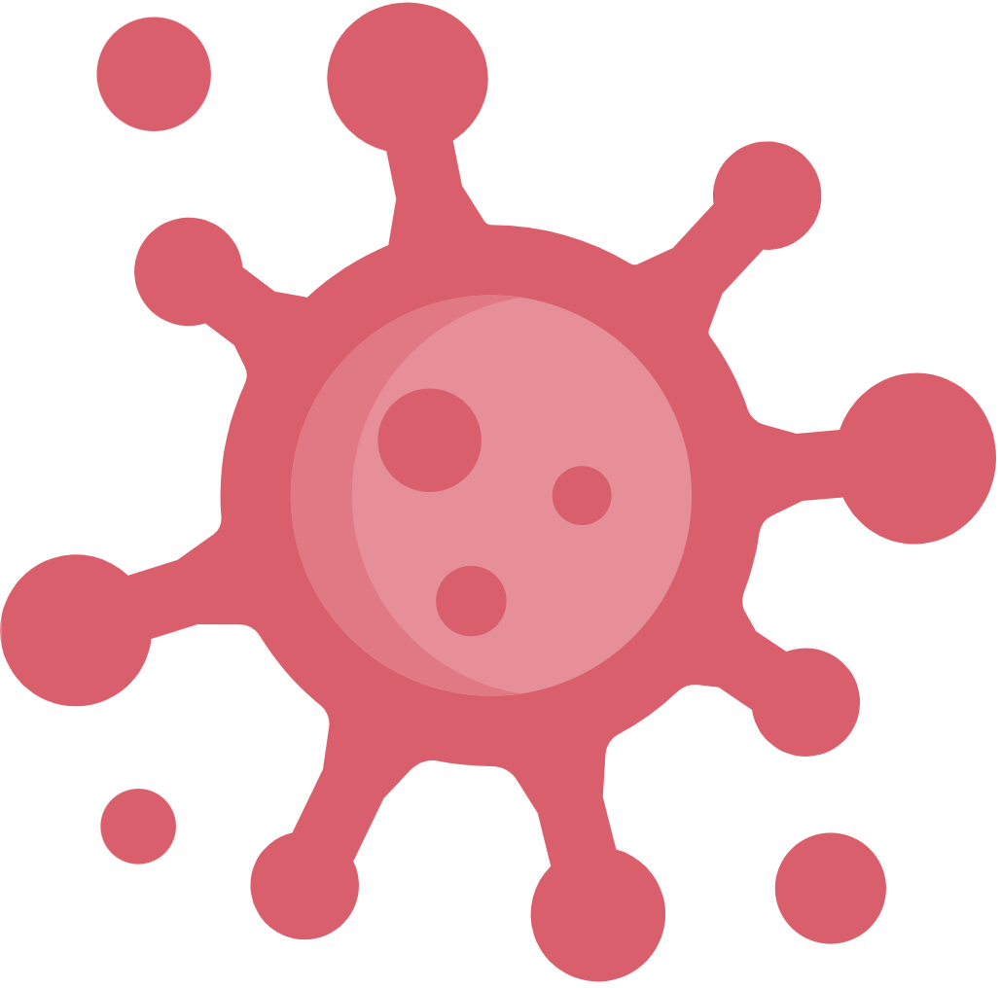
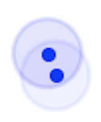

 

## Welcome to IDDS

This repository aims at becoming a workbench for researches to play with a simple but realistic model of infectious-disease spreading.

### Introduction

The year 2020 became an incredibly complicated and unpredictable journey in which people of all nationalities have been affected by a horrendous disease spreading problem (referred to as **CoVid19**). This world-wide problem came to us almost inadvertently because of the similitude of the symptoms associated with a common flu. However, this *coronavirus* (**SARS-CoV-2**) turned out being a much uncontrollable and pernicious than already-known coronaviruses, e.g., MERS and SARS. Unfortunately, humanity had to learn such a dramatic reality via the hard way. To date (October 2020), more than one million (1.07M) people have died due to the seemingly relentless virus, and more than thirty-nine million (36.9M) people have been infected worldwide. These tremendous and growing figures have been the main driver for an unprecedented spike of research in a single topic. The entire scientific community is in a unified effort on trying to *forecast* the spreading of this deadly virus, with the aim of shedding light onto the social measures we humans need to take in order to control the spreading whilst searching for a treatment, or (even better) a *vaccine*.

In this unified effort against the virus, the researching community is relying upon computational modelling for than ever before. The current scenario requires the possibility of testing *in-silico* the potential effects of different social behaviours and restrictions which cannot be carried out in live, for obvious reasons. Many models have come to light over the past few months, most of them based on deterministic equations which aim to describe the susceptible-infectious-recoverd (SIR) *flow*, which should be an average representation of what is happening out there. Such models focus then on the fitting of several free parameters of the SIR equations to try and understand the number of infections and the death toll. However, the simplicity of SIR models cannot incorporate in a natural way the complexity of a society as greatly evolved as ours. For this reason, we believe the most natural way of studying this problem should be by focusing on the individual, then suggesting an agent-based model. The SIR equations can then be seen as the simplified fluid equations compared to Molecular Dynamics. Obviously, there are model equations which are much more computationally efficient than integrating all the constituent particles' positions and velocities in time, but one cannot expect these simple equations to predict complex behaviours which are out of the underlying assumptions, e.g. this is the case of phase transitions and the Navier-Stokes equations.

The idea of this work and repository is to provide the scientific community with a free and open-source computational model which is capable of reproducing SIR-like curves when the input configuration is set to its simplest version, and many more complex behaviours (e.g. resonant and intermittent infectious modes) when social measures are taken into consideration. This is a toy model, but can become as complex as you want it to be, as it is open for your use and improvement. 

### Model

The model introduced in this repository consists in an agent-based approach which endows the *agent* with human-like properties and behaviours. An **agent** consists of the following basic attributes:

* **Position**: This is a tuple with the coordinates of the agent on the XY-plane. The agent moves around in the geometry (where it is initially set) by using the method **step**. With the aim of inducing a reasonably simple model for human motion, we have chosen a Brownian-particle dynamics, which variance fulfils an average behaviour of a human being.
* **Mobility**: The mobility modulates the size of the random displacement per unit time, which is set up by default to a "normal" human behaviour.
* **Status**: A variable which identifies the status of the agent, this being either **healthy**, **infected**, **immune** or **confined** with the aim or reflect the states of the population. The status of the agent will be reflected in its colour when represented, e.g:
  * *Infected agent*: The circle intensity is maximum and the radius is equivalent (in reduced units) to two meters.
  * *Healthy agents* walking nearby
  * *Immune agent*: Although it cannot become infected, it accumulates viral load and can widespread the disease.
  * *Confined agent*: It is removed from the geometry, therefore it overcomes the disease without transmitting the virus to the rest of agents.
* **Allow confinement**: A boolean variable to indicate whether the agent is eligible to be confined.
* **Time alive**: Time passed since the beginning of the simulation.
* **Disease**: The disease that each agent suffer. Although the disease is the same for all agents, the initial conditions and dynamics might vary from one agent to another. This helps to reflect how the disease impacts and behaves differently across the population.

Besides, the agent is endowed with the following *actions*/methods:

* **Viral force**: The intensity of viral load which an agent contributes to the environment. 
* **Step**: The function which updates the position and disease with regard to viral force it suffers. The position is recalculated by randomly choosing a sample from a normal distribution.

The **disease** object contains the dynamics of the system leading to the status transitions. The disease that each agent suffers is initialised with the following attributes: 

* **Viral load**: The intensity of viral amount that the disease contains. It is represented as a scale from 0 to 1, where 1 is the maximum viral load that the disease can bear.
* **Infection radius**: It delimits the area of influence where the disease can be transmitted. By default it is set to two meters.
* **Immunity**: An object containing information related to immunity duration and loss of immunity.
    * The duration is the time that agent remains Immune without status change regardless the viral load. It can be a fixed period for all diseases initialised or randomly drawn from a normal distribution, meaning that the immunity duration
    varies across the agents.
    * The loss of immunity evaluates whether the agent remains Immune or losses its immunity being Healthy and susceptible to become Infected again. 
* **Infection**: It specifies the disease duration as well as the transitions to recover after the infection.
    * The duration is the time the agent remains Infected regardless the viral load, i.e. the viral load for the infected agent might be reduced although the agent is still Infected.
    It can be a fixed period for all diseases initialised or randomly drawn from a normal distribution, meaning that the agents pass the disease in different periods.
    * The recovery from infection checks whether agent becomes Healthy or Immune after passing the disease.
    
In addition, the disease contains these actions:

[TBC] 

### Results

[TBC]

## Requirements

The code is written in `Python 3.7`, thus we would expect any python environment ( `Python>=3.7`) to be capable of running the code without any issue. If this is not the case, we encourage and will thank you for telling us about any issue (as described in the contributing section). Besides having the correct **python** version, you'll need to install the packages specified in the [requirements](requirements.txt) file. 

## Contributing

We encourage all the scientists and researchers to contribute to this repository to make it better and more complete and realistic. However, we encourage to read the [CONTRIBUTING.md](CONTRIBUTING.md) if you feel like contributing to this project. There you will find the basic details on how to proceed in a way which follows our standards of work and communication.

## License

This project is licensed under the GNU General Public License v3.0 - see the [LICENSE](LICENSE.md) file for details